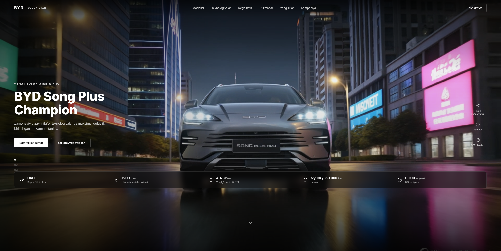

<div align="center">

# BYD Uzbekistan

**BYD Song Plus Champion** uchun kinematik landing sahifa — zamonaviy, tungi shahar fonida suzib yuruvchi hero video, shisha effektli statistika paneli va to'liq responsive dizayn.

[**🔗 Live demo**](https://byd-uzbekistan.vercel.app)


-333333?style=flat-square)



</div>

---

## Xususiyatlar

- 🎬 **Kinematik video hero** — tungi shahar fonida avtomatik ijro etiladigan video
- 🧊 **Shisha effektli (glassmorphism) statistika paneli** — DM-i tizimi, yurish zaxirasi, yoqilg'i sarfi, kafolat va tezlanish ko'rsatkichlari
- 📱 **To'liq responsive** — mobil, planshet va desktop uchun moslashtirilgan grid va navigatsiya
- 🍔 **Mobil burger-menyu** — kichik ekranlarda ochiladigan navigatsiya paneli
- 🎯 **Slayd indikatori va yon panel ikonkalar** — texnik xususiyatlar, ranglar va 360° ko'rish uchun tayyor UI
- ⚡ **Build-siz vanilla stack** — hech qanday freymvork yoki bundler talab qilmaydi, to'g'ridan-to'g'ri brauzerda ishlaydi

## Loyiha tuzilmasi

```
byd-uzbekistan/
├── index.html              # Asosiy sahifa (hero + model bo'limi)
├── assets/
│   ├── css/
│   │   └── styles.css      # Barcha uslublar (dizayn tokenlari :root'da)
│   ├── js/
│   │   └── main.js         # Burger-menyu va slayd indikatori logikasi
│   ├── video/
│   │   └── byd-hero-cinematic.mp4   # Hero fon videosi
│   ├── logo/                # Logotip fayllari (byd-uzbekistan-lockup-*.png)
│   └── images/               # Model rasmlari (song-plus-studio.jpg va h.k.)
└── README.md
```

## Lokal ishga tushirish

Loyiha hech qanday build jarayonini talab qilmaydi — faqat statik fayllarni serverdan uzatish kifoya.

**Python bilan:**
```bash
python -m http.server 5173
```

**Node.js bilan:**
```bash
npx serve -l 5173 .
```

So'ngra brauzerda oching: [http://localhost:5173](http://localhost:5173)

## Texnologiyalar

| Qatlam | Texnologiya |
|---|---|
| Struktura | Semantik HTML5 |
| Uslub | Vanilla CSS3 (custom properties, Grid, Flexbox) |
| Interaktivlik | Vanilla JavaScript (freymvorksiz) |
| Shrift | [Inter](https://fonts.google.com/specimen/Inter) (Google Fonts) |
| Hosting | [Vercel](https://vercel.com) |

## Roadmap

- [ ] Modellar katalogi bo'limi
- [ ] Texnologiyalar sahifasi (DM-i, xavfsizlik tizimlari)
- [ ] Xizmatlar va servis markazlari xaritasi
- [ ] Yangiliklar bloki
- [ ] Kompaniya haqida sahifa
- [ ] Haqiqiy brend aktivlari (logotip, studio suratlar) bilan almashtirish

## Litsenziya

Bu loyiha shaxsiy portfolio/o'quv maqsadida yaratilgan namoyish sahifasi. BYD nomi va logotipi tegishli mualliflik huquqi egasiga tegishli.

---

<div align="center">

Ishlab chiqildi [Sardor Sohinazarov](https://github.com/SardorSohinazarov) tomonidan

</div>
